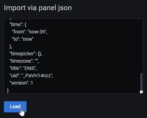

# Metrics

By default, metrics are disabled and there is no metrics server.

You can however enable metrics reporting as described below.

## [Prometheus](https://prometheus.io/docs/prometheus/latest/installation/)

To enable Prometheus metrics reporting, set `METRICS_TYPE=prometheus`.

The metrics will be reported by an HTTP server on port `9090`.

💁 You can change that with `METRICS_PROMETHEUS_ADDRESS=":9090"`.

If you have Prometheus running in a container in the same network as this DNS container (named `dns`), you can configure Prometheus to get the metrics data by adding

```yml
- job_name: 'dns'
  static_configs:
    - targets: ['dns:9090']
```

in your `scrape_configs:` block in your `prometheus.yml` configuration file.

### [Grafana](https://grafana.com/docs/grafana/latest/installation/)

To visualize metrics, I recommend using Grafana.

You can import the dashboard I designed with the following steps:

1. In your Grafana web user interface, click on the import button:

    

1. Copy the JSON code from [grafana.json](grafana.json)
1. Paste the code in the panel JSON and click **Load**:

    

### Metrics available

All the metrics exported will have the `dns_` prefix.

💁 You can change that with `METRICS_PROMETHEUS_SUBSYSTEM=dns`.

The list of all metrics available is as follows:

| Metric with prefix | Type | Dimensions | Description |
| --- | --- | --- | --- |
| `dns_hostnames_filtered` | Counter | `class`, `type` | DNS filtered out hostnames by question class and type |
| `ips_filtered` | Counter | `type` | IP addresses filtered out by response type |
| `blocked_hostnames` | Gauge | | Total number of hostnames to be blocked by the DNS server filter |
| `blocked_ips` | Gauge | | Total number of IP addresses to be blocked by the DNS server filter |
| `blocked_ip_prefixes` | Gauge | | Total number of IP address prefixes to be blocked by the DNS server filter |
| `cache_insert` | Counter | | DNS cache insertions |
| `cache_insert` | Counter | | DNS cache insertions |
| `cache_move` | Counter | | DNS cache move |
| `cache_remove` | Counter | | DNS cache remove |
| `cache_insertEmpty` | Counter | | DNS cache insertEmpty |
| `cache_getEmpty` | Counter | | DNS cache getEmpty |
| `cache_hit` | Counter | | DNS cache hit |
| `cache_expired` | Counter | | DNS cache expired |
| `cache_miss` | Counter | | DNS cache miss |
| `cache_max_entries` | Gauge | `type` | DNS cache maximum number of entries |
| `cache_labels` | Gauge | | DNS cache labels |
| `dns_dns_over_https_dials` | Counter | `url` | DNS over HTTPS dials by URL |
| `dns_over_tls_dials` | Counter | `provider`, `address`, `outcome` | DNS over TLS dials by provider, address and outcome |
| `dns_plaintext_fallback_dials` | Counter | `provider`, `address`, `outcome` | DNS dials by provider, address and outcome |
| `requests_received` | Counter | | Requests received by the server |
| `questions_received` | Counter | `class`, `type` | Questions contained in requests received by the server |
| `response_rcodes` | Counter | `rcode` | Response codes |
| `answers_sent` | `class`, `type` | | Answers contained in responses sent by the server |
| `responses_sent` | Counter | | Responses sent out by the server |
| `requests_inflight` | Gauge | | Requests in flight in the server |
